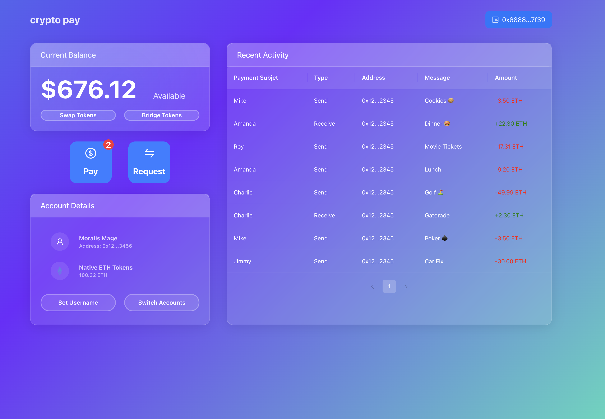

# 🌐 CryptoPay - Web3 Demonstration DApp

## ✨ About The Project

**CryptoPay** is a demonstration application showcasing core Web3 interactions. This minimalist DApp provides hands-on experience with:

- 🔗 Wallet connection (MetaMask integration)
- 💸 Basic transaction functionality
- 📨 Payment request system
- 📊 Transaction history tracking

> Smart Contract: [0x8329...Bcf7](https://sepolia.etherscan.io/address/0x8329B59C6325637a9A7abD430615c8c94028Bcf7) on Sepolia Testnet
